# Thomas Connor McKinnon

My name is Connor McKinnon! I am a senior studying Aerospace Engineering at Auburn University and Formula SAE design engineer with two years of competition experience. I will be graduating in Spring 2025 and seeking full-time positions to contribute to project success in modeling and simulation, satellite and spacecraft missions, and manufacturing.

# Projects
- [Formula SAE Design and Manufacturing](#formula-sae-rear-wing-design-and-manufacturing)
- [Aircraft 6DOF Simulation](#aircraft-6dof-simulation)
- [MATLAB Inviscid Panel Method](#linear-vorticity-panel-method)

## Formula SAE Rear Wing Design and Manufacturing

### Responsibilities and Achievements:
- Designed and manufactured the rear aerodynamic package for the Auburn FSAE '23 vehicle
- Improved the rear wing downforce to drag ratio from 1.5 in previous years to 2.75.
- Collaborated with an aerodynamics student team to set and fulfill design targets for downforce, drag, weight, and center of pressure location.
- Modeled the rear wing package in a full vehicle assembly to ensure integration of all subsystems.

### Software Tools and Skills:
- CAD modeling: Siemens NX
- RANS Computational Fluid Dynamics: Siemens STAR-CCM+
- Carbon fiber composites manufacturing
- Manual lathe and mill machining

### Final Model and Implementation

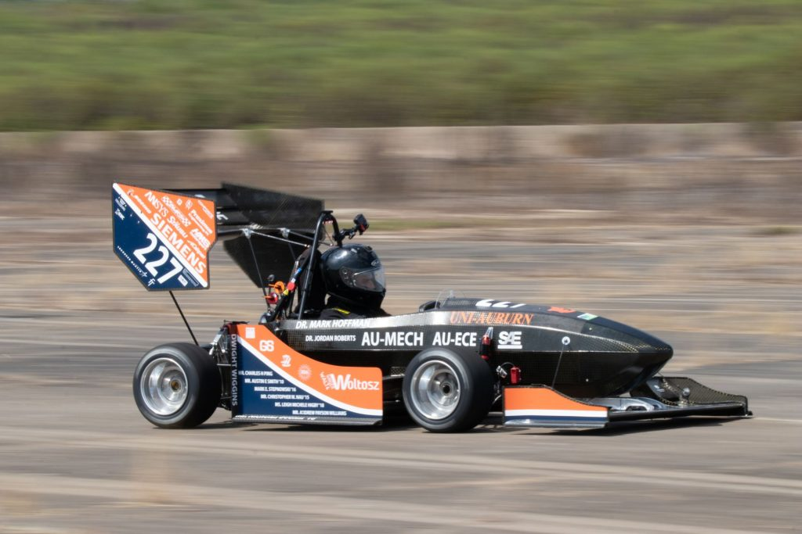

### Design Overview

<iframe width="100%" height="800" src="Formula_SAE/aero_rear_design_binder.pdf"></iframe>

***

## Aircraft 6DOF Simulation
- MATLAB 6DOF script to model elevator impulse response of a Learjet C-21
- Final project for AERO 3230 Flight Dynamics course

### Inputs:
- [Learjet C-21 aircraft parameters](6DOF/learjet_parameters.png)
- Elevator, aileron, or rudder deflection function

### Outputs:
- Time response plots of aircraft state vector and flight parameters

### Computation Loop Overview

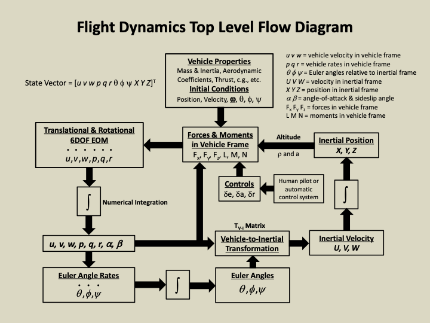

### Time Response Plots
*Altitude, angle of attack, and pitch angle response to a -5˚ elevator deflection for 0.1 seconds at t = 20 seconds*

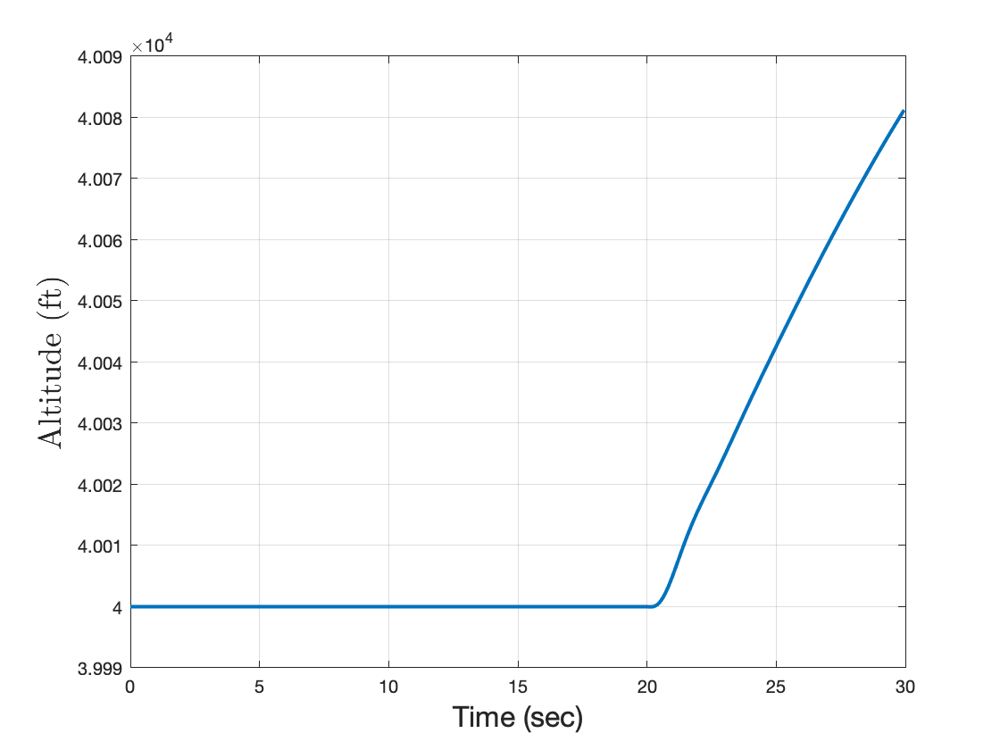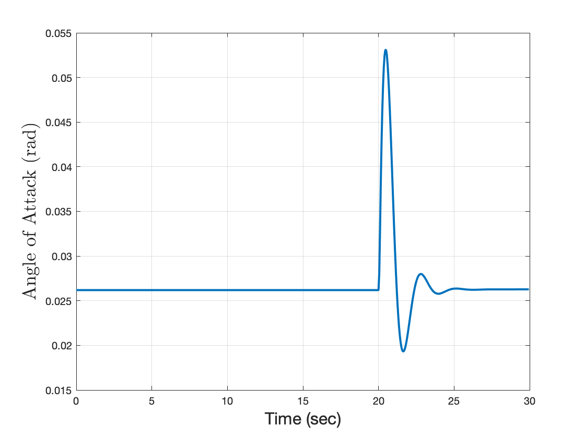

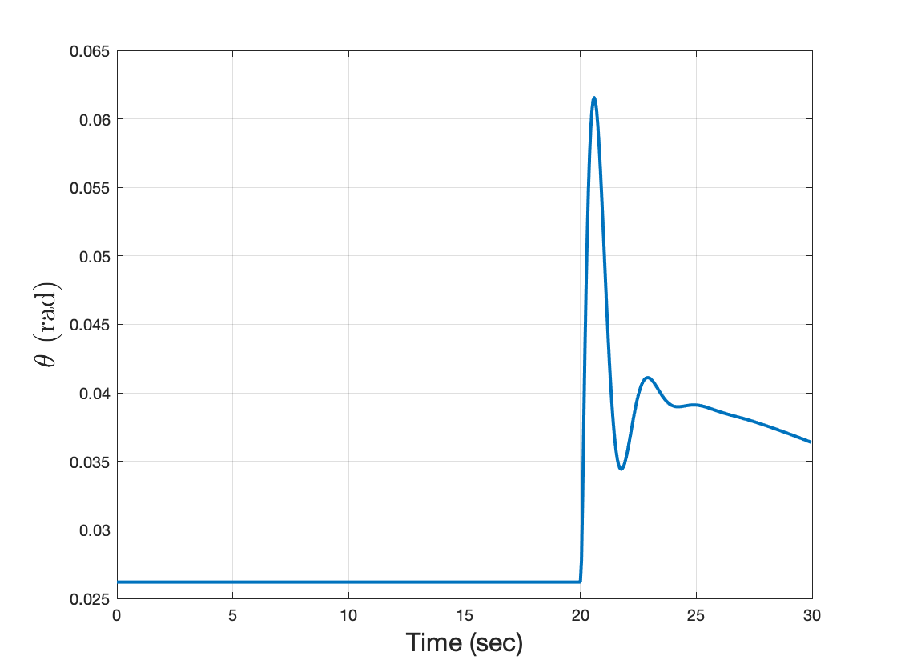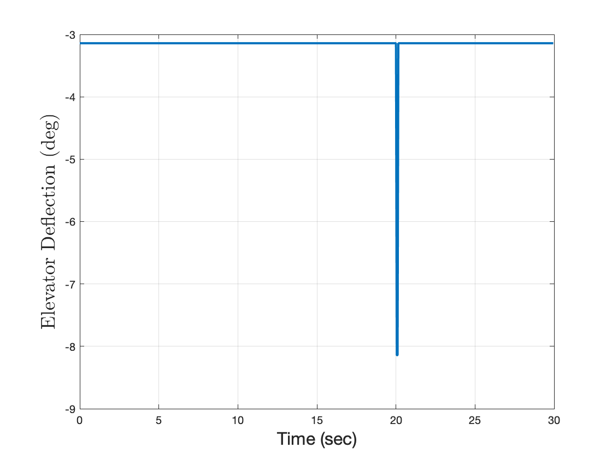

***

## Linear Vorticity Panel Method
- A personal project to look deeper into pressure and lift approximation techniques discussed in coursework for inviscid aerodynamic theory.
- A MATLAB script that implements a panel method of a linear strength vorticity distribution to approximate the lift and pressure coefficient curve for a NACA 4-digit series airfoil.

### Inputs:
- NACA airfoil parameters (eg. NACA 0012)
- An array or single value for angle of attack (AoA)

### Outputs:
- Approximated section lift coefficient
- Pressure coefficient surface distribution
- Velocity field of flow domain

### NACA 0012 Plots
*NACA 0012 geometry, XFOIL comparison, streamlines, and Cp distributions for a 5˚ angle of attack*

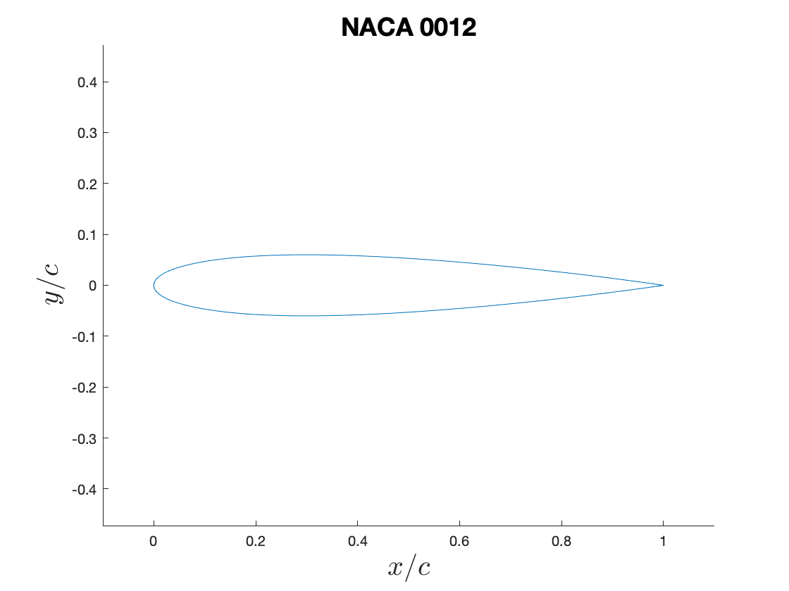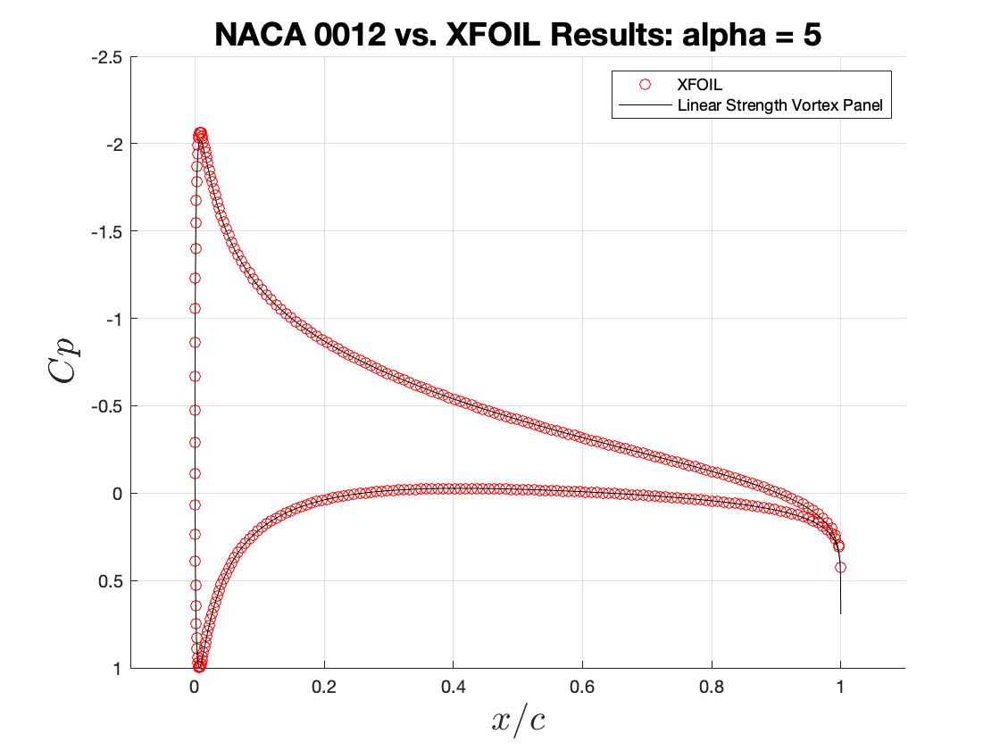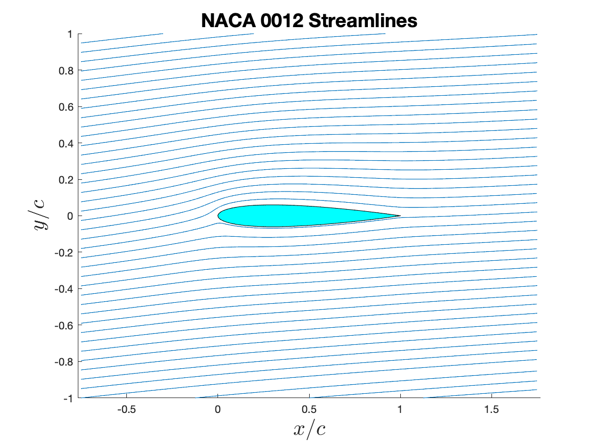

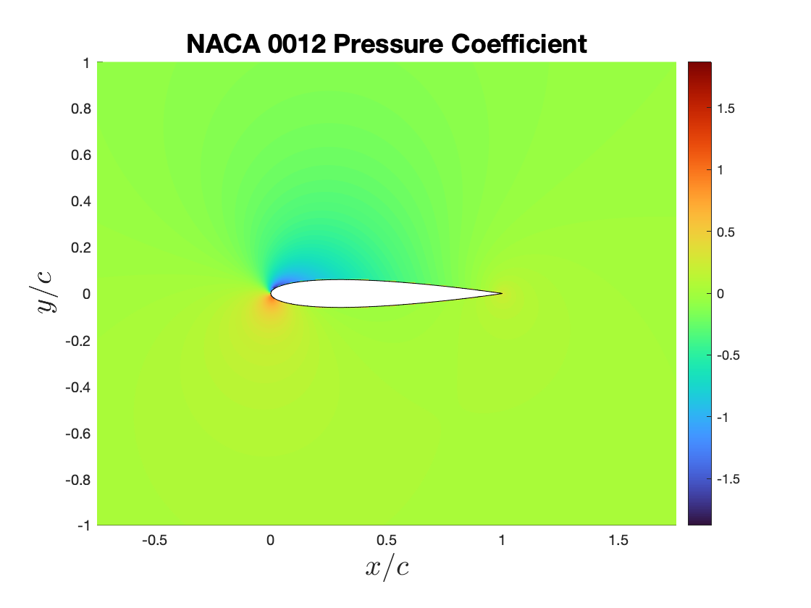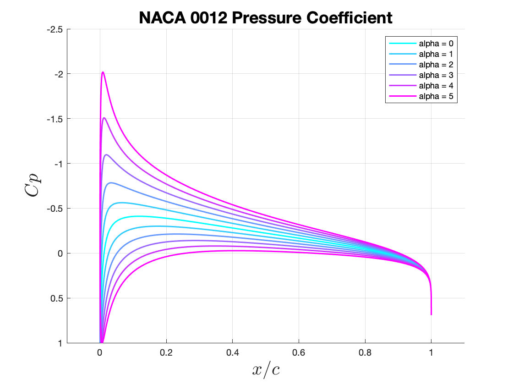