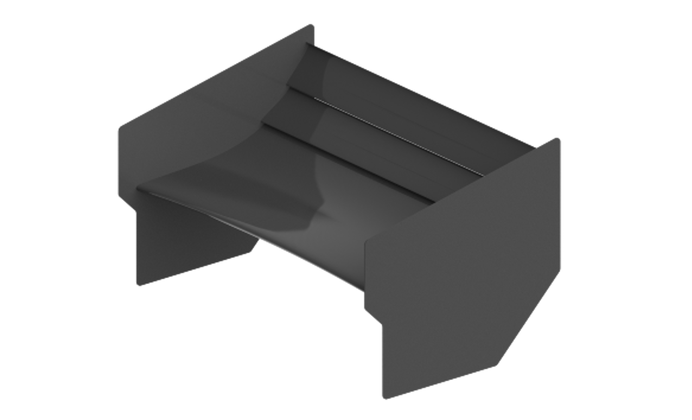
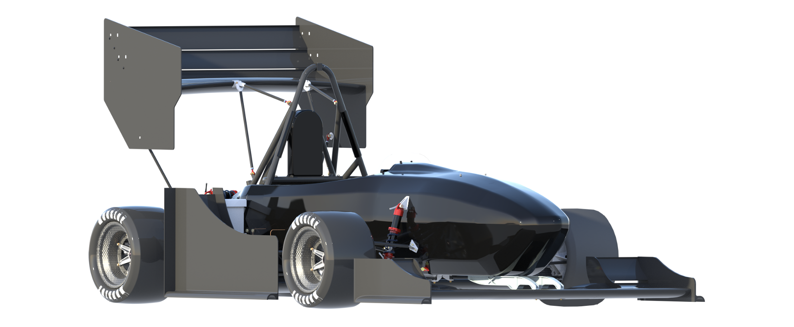

# Thomas Connor McKinnon

Senior studying Aerospace Engineering at Auburn University and Formula SAE design engineer with two years of competition experience. Graduating in Spring 2025 and seeking full-time positions to contribute to project success in manufacturing engineering.

# Projects
### Formula SAE Rear Wing Design and Manufacturing

### Aircraft 6DOF Simulation

### Truss Design

### Inviscid Zeroth Order Panel Method

