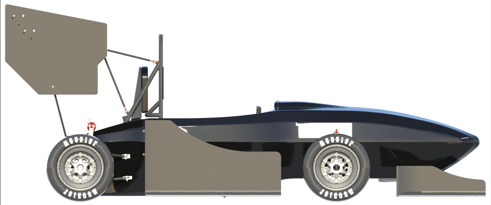

# Thomas Connor McKinnon

Senior studying Aerospace Engineering at Auburn University and Formula SAE design engineer with two years of competition experience. Graduating in Spring 2025 and seeking full-time positions to contribute to project success in manufacturing engineering.

# Projects
- [Formula SAE Design and Manufacturing](#formula-sae-rear-wing-design-and-manufacturing)
- [Aircraft 6DOF Simulation](#aircraft-6dof-simulation)
- [Truss Design](#truss-design)
- [MATLAB Inviscid Panel Method](#inviscid-zeroth-order-panel-method)
### Formula SAE Rear Wing Design and Manufacturing

### Aircraft 6DOF Simulation

### Truss Design

### Inviscid Zeroth Order Panel Method

