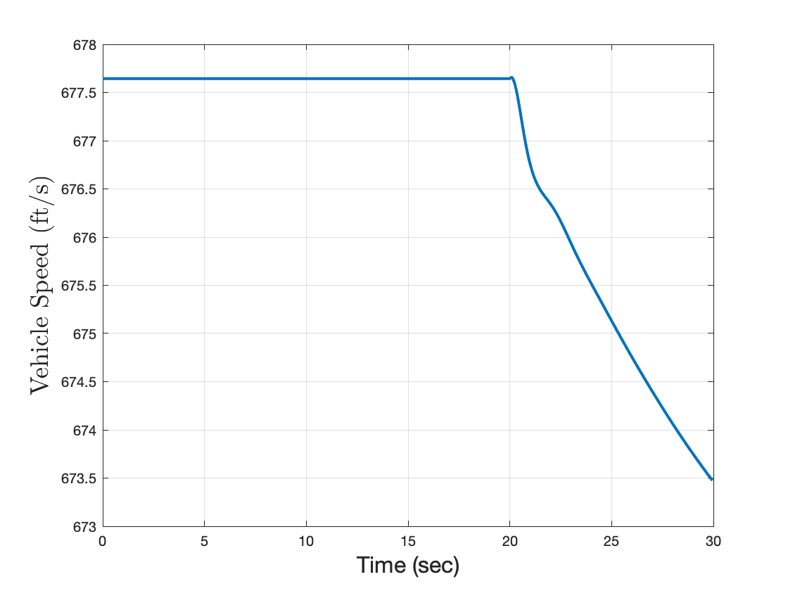

# Thomas Connor McKinnon

My name is Connor McKinnon! I am a senior studying Aerospace Engineering at Auburn University and Formula SAE design engineer with two years of competition experience. Graduating in Spring 2025 and seeking full-time positions to contribute to project success in manufacturing engineering.

# Projects
- [Formula SAE Design and Manufacturing](#formula-sae-rear-wing-design-and-manufacturing)
- [Aircraft 6DOF Simulation](#aircraft-6dof-simulation)
- [Truss Design](#truss-design)
- [MATLAB Inviscid Panel Method](#inviscid-zeroth-order-panel-method)
### Formula SAE Rear Wing Design and Manufacturing
##### Responsibilities and Achievements:
- Designed and manufactured the rear aerodynamic package for the Auburn FSAE '23 vehicle
- Improved the rear wing downforce to drag ratio from 1.5 in previous years to 2.75.
- Collaborated with an aerodynamics student team to set and fulfill design targets for downforce, drag, weight, and center of pressure location.
- Modeled the rear wing package in a full vehicle assembly to ensure integration of all subsystems.
##### Software Tools and Skills:
- CAD modeling | Siemens NX
- RANS Computational Fluid Dynamics | Siemens STAR-CCM+
- Carbon fiber composites manufacturing
- Manual lathe and mill machining

##### Design Overview
- [Rear Aerodynamics Design Presentation](Formula_SAE/aero_rear_design_binder.pdf)

##### Final Model and Implementation

### Aircraft 6DOF Simulation
*MATLAB 6DOF script to model pitch impulse response of a Learjet C-21*
Final project for AERO 3230 Flight Dynamics course.
##### Inputs:
- Learjet C-21 aircraft and dynamic parameters
- Elevator, aileron, or rudder deflection function
##### Outputs:
- Time response plots of aircraft state vector and flight parameters

##### Computation Loop Overview

##### Time Response Plots

*5˚ aileron deflection for 0.1 seconds at t = 20 seconds*
### Truss Design

### Inviscid Zeroth Order Panel Method

